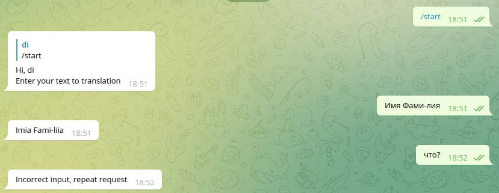

# Docker bot-tg
Telegram bot translitetare full name from cyrillic to latin to the norm of MFA.

 

## First, add token from [@BotFather](https://t.me/botfather) to dockerfile

and then:
```
docker build -t bot .
docker run -d -p 80:80 bot
```


